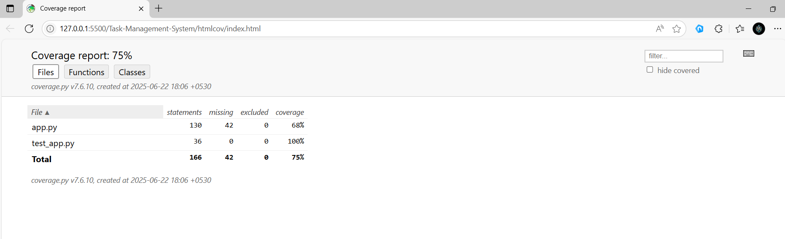
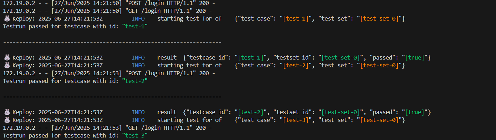
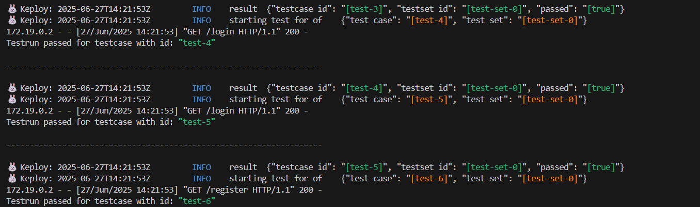
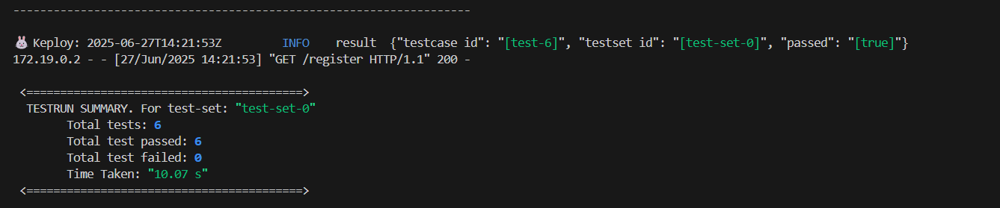
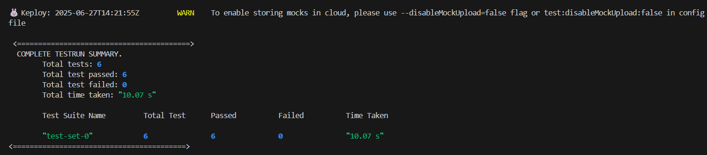

# Task Management System

## Table of Contents
- [About Project](#about-project)
- [Installation](#installation)
- [Run the Project](#run-the-project)
- [Features](#features)
- [Testing](#testing)
- [Contribution](#contribution)
- [License](#license)
- [Contact Me](#contact-me)

## About Project
The **Task Management System** is a web application designed to help users efficiently manage tasks by creating, updating, and tracking their progress. It provides an intuitive interface for managing personal or team-based task assignments. This project was built using **Flask**, **SQLite**, and supports full CRUD operations via APIs.

## Installation
Follow these steps to clone the repository and install the required dependencies:

```bash
# Clone the repository
git clone https://github.com/anandsundaramoorthysa/Task-Management-System.git

# Navigate into the project directory
cd Task-Management-System

# Create and activate a virtual environment (optional but recommended)
python -m venv venv
source venv/bin/activate  # On Windows use `venv\Scripts\activate`

# Install dependencies
pip install -r requirements.txt
````

## Run the Project

To start the application, execute the following command:

```bash
python app.py
```

Then open your browser and go to `http://127.0.0.1:5000/` to access the Task Management System.

## Features

* 🧑‍💼 User authentication (Register/Login)
* ✅ Task creation, update, and delete (CRUD)
* 📊 Status tracking (Pending / Completed)
* 💡 Simple and clean dashboard for viewing tasks
* 🔐 Secure password hashing with `bcrypt`
* 🗃️ SQLite database for persistent storage
* 📱 Responsive design for mobile and desktop

## Testing


This project includes:

* ✅ **Unit Tests** — Validating core logic
* 🔁 **Integration Tests** — Checking interaction with database
* 🌐 **API Tests** — Ensuring endpoint behavior

All tests are located in the `test_app.py` file.

### How to Run Tests

Activate your environment and run the following commands:

```bash
# Run tests and collect coverage
coverage run test_app.py

# View coverage in terminal
coverage report

# Generate detailed HTML report
coverage html
```

Then open `htmlcov/index.html` in your browser to view the visual coverage report.

---

### Test Report



---

## Keploy API Test Reports

Here are the test reports generated using Keploy AI API Testing:







## Contribution

Contributions are welcome! If you'd like to contribute, please follow these steps:

1. Fork the repository.
2. Create a new branch (`git checkout -b feature-branch`).
3. Commit your changes (`git commit -m 'Add new feature'`).
4. Push to the branch (`git push origin feature-branch`).
5. Open a Pull Request.

## License

This project is licensed under the MIT License - see the [LICENSE](LICENSE) file for details.

## Contact Me

If you have any questions or would like to collaborate, feel free to reach out:

* **Email**: [sanand03072005@gmail.com](mailto:sanand03072005@gmail.com?subject=Inquiry%20About%20Task%20Management%20System%20Project&body=Hi%20Anand,%0A%0AI'm%20interested%20in%20learning%20more%20about%20the%20Task%20Management%20System%20you%20developed.%20I%20have%20some%20questions%20about%20how%20it%20manages%20tasks%2C%20authentication%2C%20and%20collaboration%20features.%20Additionally%2C%20I%20would%20like%20to%20discuss%20potential%20collaborations.%0A%0AThank%20you!%0A%0ABest%20regards,%0A[Your%20Name])
* **LinkedIn**: [Anand Sundaramoorthy](https://www.linkedin.com/in/anandsundaramoorthysa/)
